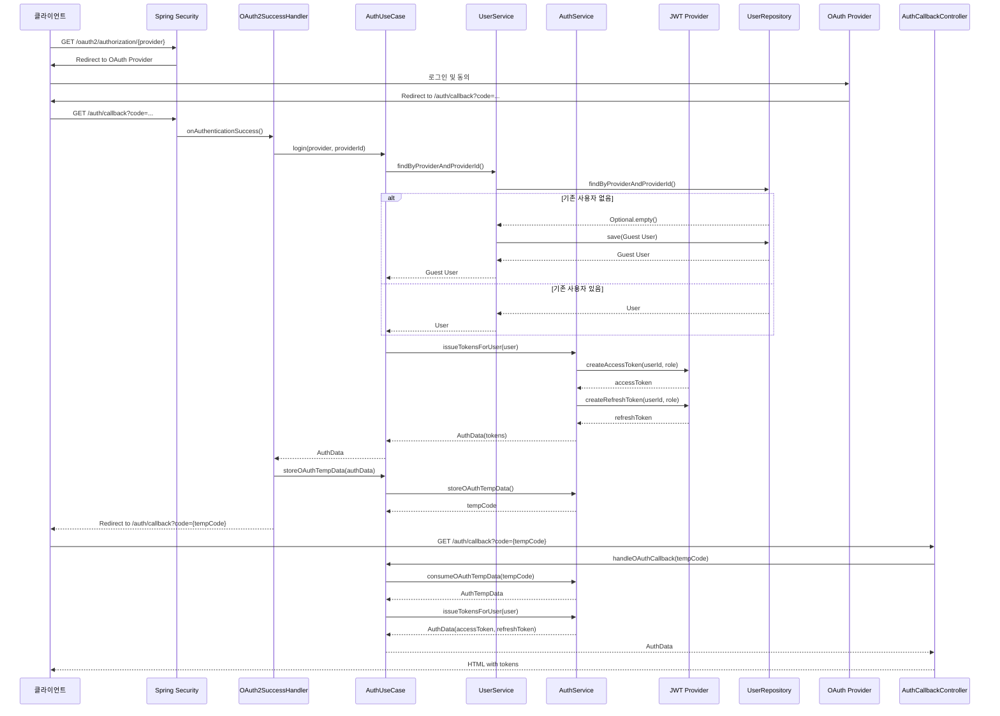
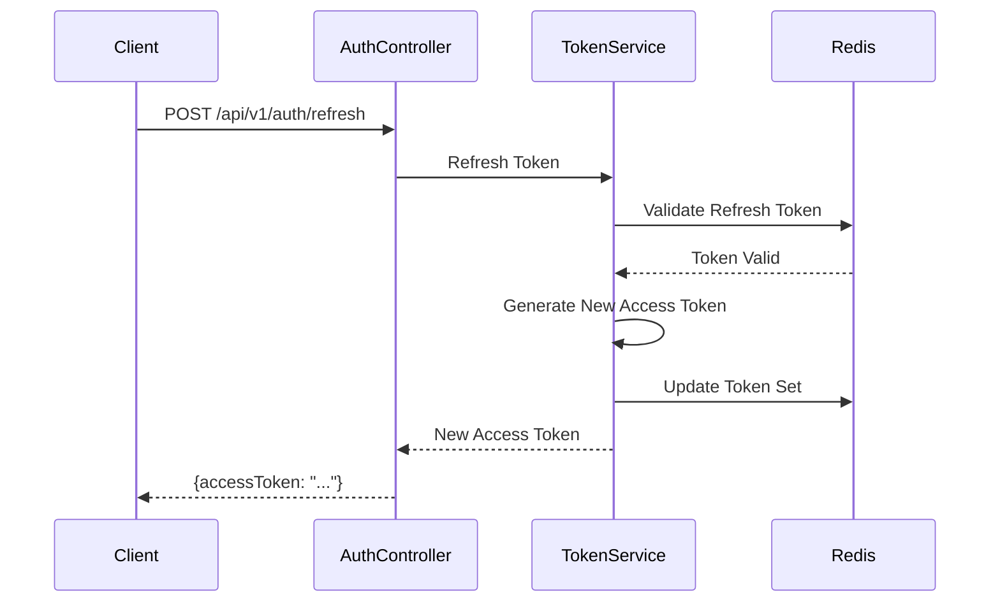
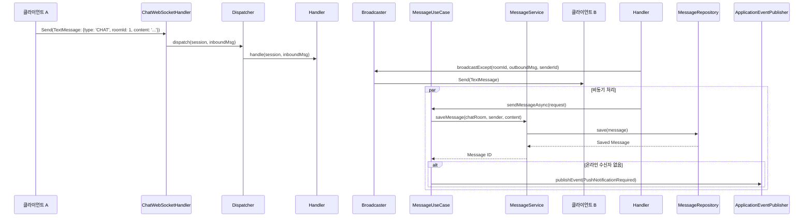
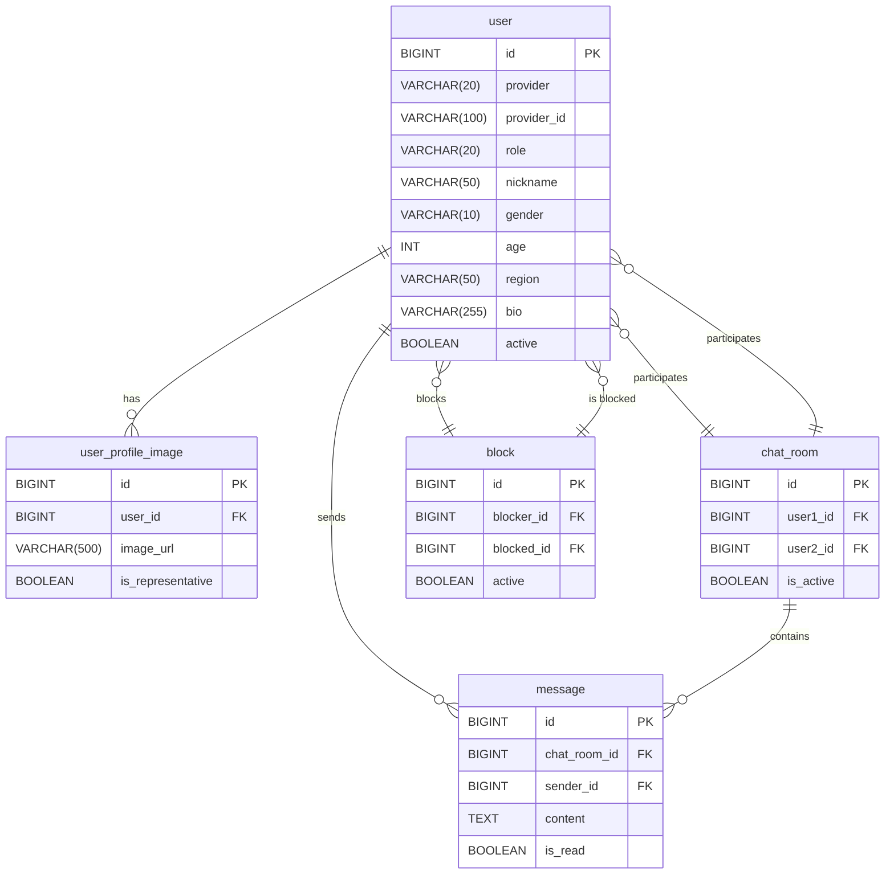

# 1:1 익명 채팅 애플리케이션 (Spring Boot 백엔드)
[](https://spring.io/projects/spring-boot)
[](https://openjdk.java.net/)
[](https://developer.mozilla.org/en-US/docs/Web/API/WebSocket)
[](https://jwt.io/)

## 1. 프로젝트 소개

이 프로젝트는 사용자들이 익명으로 1:1 실시간 채팅을 나눌 수 있는 백엔드 서버입니다. Spring Boot, Spring Security, WebSocket, JWT, OAuth2 등을 활용하여 안정적이고 확장 가능한 시스템을 구축하는 데 중점을 두었습니다.

**주요 목표:**
- 실시간 통신의 안정적인 처리
- 상태 비저장(Stateless) 인증 시스템 구축
- 계층형 아키텍처를 통한 유지보수성 및 테스트 용이성 확보

### 1.1 기술스택
#### **Backend Core**
- **Spring Boot 3.5.3**
- **Java 21**
- **Spring Security 6** - OAuth2 + JWT 보안 구현
- **Spring WebSocket** - 실시간 양방향 통신

#### **Data & Persistence**
- **Spring Data JPA** + **Hibernate** - ORM
- **QueryDSL** - 타입세이프 동적 쿼리
- **H2 Database** - 개발/테스트 환경
- **Redis** - 토큰 저장소 및 세션 관리

#### **DevOps & Tools**
- **Gradle (Kotlin DSL)** - 빌드 도구
- **Docker** + **Testcontainers** - 컨테이너 기반 테스트
- **JaCoCo** - 코드 커버리지 측정
- **OpenAPI 3.0** (Swagger) - API 문서 자동 생성

## 2. 주요 기능

- **인증 및 사용자 관리**
  - OAuth2 (Google, Kakao, Naver) 소셜 로그인
  - JWT (Access/Refresh Token) 기반의 상태 비저장 인증
  - 닉네임, 프로필 이미지, 자기소개 등 사용자 프로필 관리
  - 다른 사용자 검색 및 차단 기능

- **실시간 채팅**
  - WebSocket을 통한 1:1 채팅방 기능
  - 채팅방 목록 조회 (상대방 정보, 마지막 메시지, 안 읽은 수 포함)
  - 이전 대화 내용 불러오기 (Cursor-based Pagination)
  - 메시지 실시간 읽음 처리 및 상대방에게 알림

## 3. 아키텍처 및 기술적 결정

### 3.1 계층형 아키텍처 (Hexagonal Architecture 일부 적용)
시스템의 각 부분이 명확한 책임을 갖도록 계층형 아키텍처를 적용하여 유지보수성과 테스트 용이성을 극대화했습니다.

외부(API, UI)의 변경이 핵심 비즈니스 로직(Domain)에 영향을 주지 않도록 격리하고, 기술 종속적인 부분(Infrastructure)을 분리하여 향후 기술 스택 변경에 유연하게 대응할 수 있도록 설계했습니다.
```
┌─────────────────────────────────────────────────────────┐
│                   Presentation Layer                    │
│  • REST Controllers (User, Chat, Auth, Block)          │
│  • WebSocket Handlers (Real-time messaging)            │
│  • Global Exception Handler                            │
│  • Security Filters & Interceptors                     │
└─────────────┬───────────────────────────────────────────┘
              │
┌─────────────▼───────────────────────────────────────────┐
│                   Application Layer                     │
│  • Use Cases (비즈니스 흐름 제어)                        │
│  • Services (핵심 비즈니스 로직)                         │
│  • DTOs (계층 간 데이터 전송)                            │
│  • Event Handlers (비동기 처리)                         │
└─────────────┬───────────────────────────────────────────┘
              │
┌─────────────▼───────────────────────────────────────────┐
│                     Domain Layer                        │
│  • Entities (JPA)                                      │
│  • Repository Interfaces                               │
│  • Domain Models & Types                               │
│  • Business Rules                                      │
└─────────────┬───────────────────────────────────────────┘
              │
┌─────────────▼───────────────────────────────────────────┐
│                 Infrastructure Layer                    │
│  • JPA Repositories & QueryDSL                         │
│  • Redis Token Storage                                 │
│  • JWT Token Provider                                  │
│  • File Storage & External APIs                        │
└─────────────────────────────────────────────────────────┘
```

### 3.2. 핵심 기술과 결정 이유

- **`WebSocket`**: 실시간 양방향 통신을 위해 표준 기술인 WebSocket을 채택했습니다. 특히 STOMP와 같은 고수준 프로토콜 대신, 더 세밀한 제어가 가능한 저수준 API(`TextWebSocketHandler`)를 사용하여 `ENTER`, `CHAT`, `READ` 등 커스텀 메시지 타입을 정의하고, 사용자별 세션 상태를 직접 관리하여 유연성을 확보했습니다.

- **`JWT & Redis`**: 서버 확장성을 고려하여 세션 대신 상태 비저장(Stateless) JWT 인증 방식을 선택했습니다. Access Token의 짧은 만료 주기를 보완하기 위해 Refresh Token을 도입했으며, 이 Refresh Token을 **Redis**에 저장하여 보안(탈취 시 빠른 무효화)과 성능을 모두 만족시켰습니다. 로그아웃 시에는 Access Token을 Redis 블랙리스트에 등록하여 즉각적인 토큰 무효화를 구현했습니다.

- **`JPA & QueryDSL`**: 데이터베이스와의 상호작용을 객체 지향적으로 처리하기 위해 JPA를 사용했습니다. 복잡한 검색 조건(사용자 필터링, 채팅방 목록 조회 등)을 처리하기 위해, 컴파일 시점에 오류를 잡을 수 있는 타입-세이프(Type-safe)한 **QueryDSL**을 도입하여 런타임 SQL 오류 가능성을 크게 줄이고 코드의 안정성을 높였습니다.

- **`비동기 처리 (@Async)`**: 채팅 메시지 저장 및 푸시 알림과 같이 즉각적인 응답이 필요 없는 작업을 비동기적으로 처리하여, 메시지 전송의 실시간 응답성을 저해하지 않도록 설계했습니다. 실패 시 재시도 및 모니터링을 위한 이벤트 기반 아키텍처를 일부 도입했습니다.

#### **WebSocket + 커스텀 프로토콜**
```javascript
// STOMP 대신 직접 구현한 메시지 프로토콜
{
  "messageType": "CHAT|ENTER|LEAVE|READ",
  "chatRoomId": 1001,
  "payload": { "content": "안녕하세요!" }
}
```
**선택 이유**: STOMP보다 더 세밀한 제어가 가능하여, 읽음 처리, 입장/퇴장 알림 등 복잡한 채팅 기능을 효율적으로 구현할 수 있습니다.

#### **JWT + Redis 하이브리드 인증**
```java
// Access Token: 짧은 수명 (15분) - 메모리에서 검증
// Refresh Token: 긴 수명 (7일) - Redis에 저장
@Service
public class TokenStorageService {
    // Redis에 사용자별로 토큰 세트 관리
    private void storeTokenSet(Long userId, TokenSet tokens) {
        redisTemplate.setex(
            "refreshToken:" + userId, 
            Duration.ofDays(7), 
            tokens
        );
    }
}
```
**선택 이유**: 서버 확장성을 위한 Stateless 설계와 보안성을 모두 만족시키는 최적의 조합이라고 생각했습니다.

#### **QueryDSL을 통한 타입세이프 쿼리**
```java
// 컴파일 타임에 SQL 오류 검증 가능
public Slice<UserSearchResponse> searchUsers(SearchConditionRequest condition, Pageable pageable) {
    return queryFactory.selectFrom(user)
            .where(
                genderEq(condition.getGender()),
                ageBetween(condition.getMinAge(), condition.getMaxAge()),
                regionEq(condition.getRegion()),
                user.active.isTrue()
            )
            .orderBy(user.lastActiveAt.desc())
            .fetch();
}
```

#### **이벤트 기반 비동기 처리**
```java
@EventListener
@Async
public void handlePushNotification(PushNotificationRequired event) {
    // 메시지 전송 성능에 영향주지 않는 비동기 푸시 알림
    pushNotificationService.sendNotification(event);
}
```

## 4. 핵심 플로우
### 4.1. 사용자 회원가입 및 로그인

OAuth2 소셜 로그인을 통해 사용자가 시스템에 처음 접근하여 회원가입하고, JWT를 발급받는 과정입니다.



### 4.2 JWT 토큰 갱신


### 4.3 실시간 채팅 메시지


## 5. 데이터베이스 ERD



## 6. 시작하기

### 6.1. 요구사항
- Java 17
- Gradle 8.x
- Redis

### 6.2. 설정
1. 프로젝트를 클론합니다.
   ```bash
   git clone https://github.com/your-repo/anonymous-chat-server.git
   ```
2. `src/main/resources/application.yml` 파일을 열고, `jwt` 및 `spring.security.oauth2.client` 섹션에 자신의 시크릿 키와 클라이언트 ID/Secret을 입력합니다.

### 6.3. 실행
1. 프로젝트를 빌드합니다.
   ```bash
   ./gradlew build
   ```
2. 애플리케이션을 실행합니다.
   ```bash
   java -jar build/libs/anonymous-chat-server-0.0.1-SNAPSHOT.jar
   ```

## 7. 상세 문서

더 자세한 정보는 아래 문서들을 참고하세요.

- **[API 명세서](./docs/api.md)**
- **[요구사항 정의서](docs/요구사항정의서.md)**
- **[기능 목록](./docs/기능목록.md)**
- **[화면 흐름도](./docs/화면흐름도.md)**
- **[시퀀스 다이어그램](./docs/sequence-diagrams.md)**
- **[클래스 다이어그램](./docs/class-diagram.md)**
- **[객체-관계 다이어그램 (ERD)](./docs/erd.md)**
- **[프로젝트 구조 및 결정 근거](docs/프로젝트-구조-및-결정-근거.md)**
