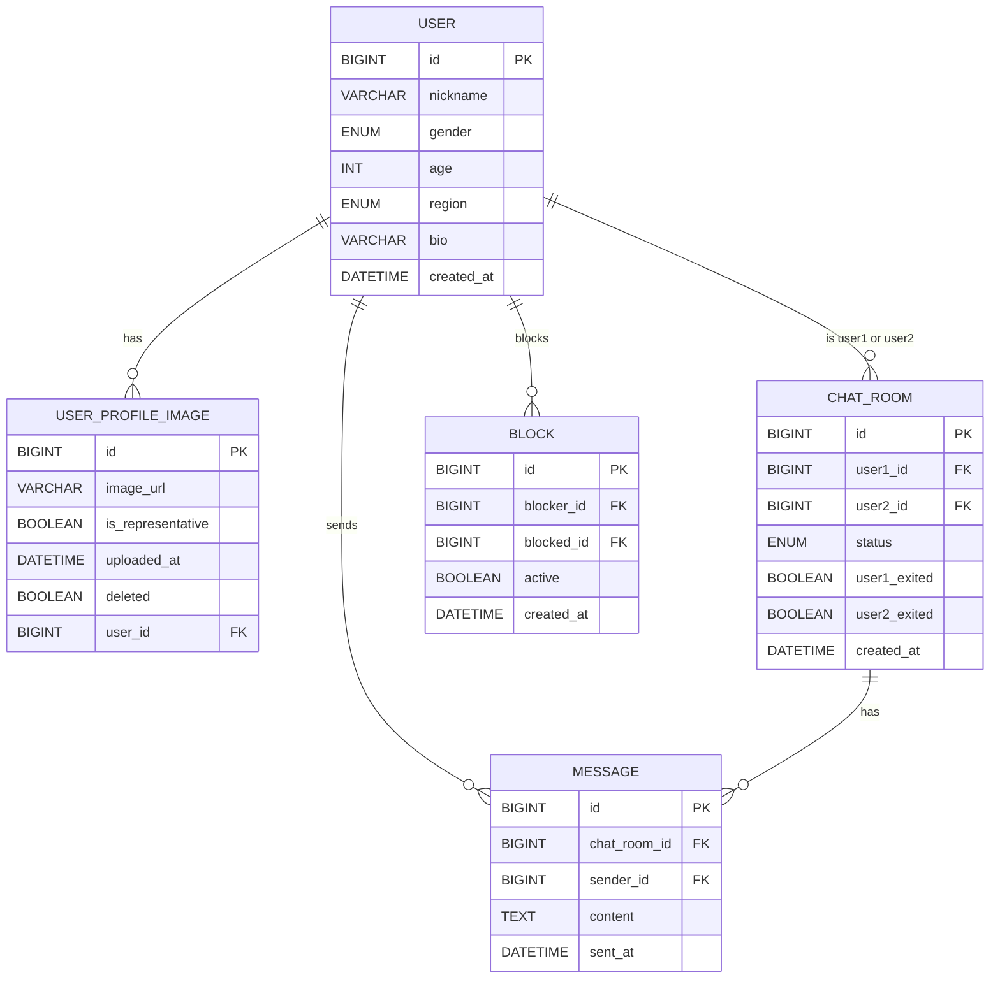

```mermaid
erDiagram

    USER {
        BIGINT id PK
        VARCHAR nickname
        ENUM gender
        INT age
        ENUM region
        VARCHAR bio
        DATETIME created_at
    }

    USER_PROFILE_IMAGE {
        BIGINT id PK
        VARCHAR image_url
        BOOLEAN is_representative
        DATETIME uploaded_at
        BOOLEAN deleted
        BIGINT user_id FK
    }

    CHAT_ROOM {
        BIGINT id PK
        BIGINT user1_id FK
        BIGINT user2_id FK
        ENUM status
        BOOLEAN user1_exited
        BOOLEAN user2_exited
        DATETIME created_at
    }

    MESSAGE {
        BIGINT id PK
        BIGINT chat_room_id FK
        BIGINT sender_id FK
        TEXT content
        DATETIME sent_at
    }

    BLOCK {
        BIGINT id PK
        BIGINT blocker_id FK
        BIGINT blocked_id FK
        BOOLEAN active
        DATETIME created_at
    }

    USER ||--o{ USER_PROFILE_IMAGE : "has"
    USER ||--o{ CHAT_ROOM : "is user1 or user2"
    USER ||--o{ MESSAGE : "sends"
    USER ||--o{ BLOCK : "blocks"
    CHAT_ROOM ||--o{ MESSAGE : "has"

```