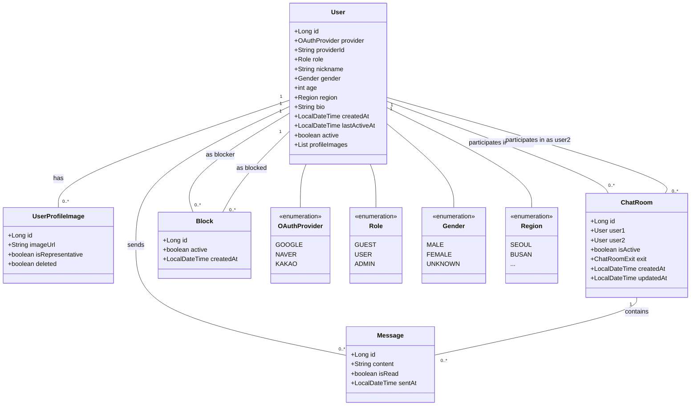

# 클래스 다이어그램

이 문서는 프로젝트의 핵심 도메인 엔티티 간의 관계를 나타내는 클래스 다이어그램입니다.

```mermaid
classDiagram
    class User {
        +Long id
        +OAuthProvider provider
        +String providerId
        +Role role
        +String nickname
        +Gender gender
        +int age
        +Region region
        +String bio
        +LocalDateTime createdAt
        +LocalDateTime lastActiveAt
        +boolean active
        +List<UserProfileImage> profileImages
    }

    class UserProfileImage {
        +Long id
        +String imageUrl
        +boolean isRepresentative
        +boolean deleted
    }

    class ChatRoom {
        +Long id
        +User user1
        +User user2
        +boolean isActive
        +ChatRoomExit exit
        +LocalDateTime createdAt
        +LocalDateTime updatedAt
    }

    class Message {
        +Long id
        +String content
        +boolean isRead
        +LocalDateTime sentAt
    }

    class Block {
        +Long id
        +boolean active
        +LocalDateTime createdAt
    }

    User "1" -- "0..*" UserProfileImage : has
    User "1" -- "0..*" ChatRoom : participates in as user1
    User "1" -- "0..*" ChatRoom : participates in as user2
    User "1" -- "0..*" Message : sends
    User "1" -- "0..*" Block : as blocker
    User "1" -- "0..*" Block : as blocked

    ChatRoom "1" -- "0..*" Message : contains

    %% Enum Types
    class OAuthProvider {
        <<enumeration>>
        GOOGLE
        NAVER
        KAKAO
    }

    class Role {
        <<enumeration>>
        GUEST
        USER
        ADMIN
    }

    class Gender {
        <<enumeration>>
        MALE
        FEMALE
        UNKNOWN
    }

    class Region {
        <<enumeration>>
        SEOUL
        BUSAN
        ...
    }

    User -- OAuthProvider
    User -- Role
    User -- Gender
    User -- Region
```
