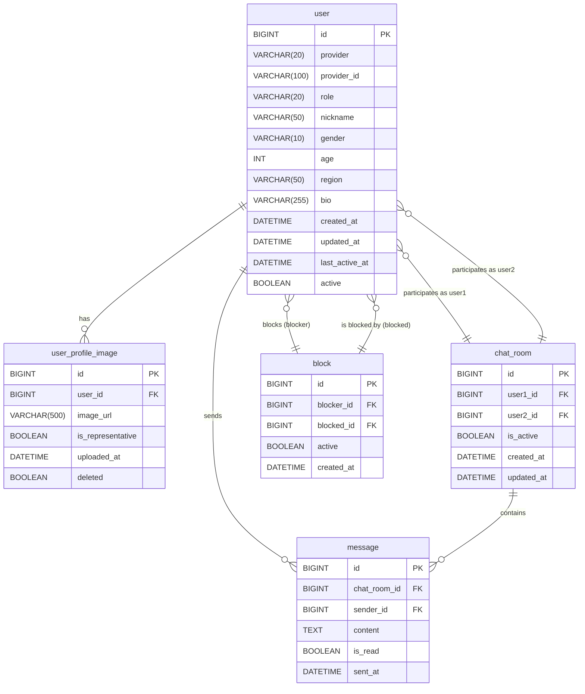

# ERD (Entity-Relationship Diagram)

이 문서는 데이터베이스의 엔티티 관계를 나타내는 다이어그램입니다.

```mermaid
erDiagram
    user {
        BIGINT id PK
        VARCHAR(20) provider
        VARCHAR(100) provider_id
        VARCHAR(20) role
        VARCHAR(50) nickname
        VARCHAR(10) gender
        INT age
        VARCHAR(50) region
        VARCHAR(255) bio
        DATETIME created_at
        DATETIME updated_at
        DATETIME last_active_at
        BOOLEAN active
    }

    user_profile_image {
        BIGINT id PK
        BIGINT user_id FK
        VARCHAR(500) image_url
        BOOLEAN is_representative
        DATETIME uploaded_at
        BOOLEAN deleted
    }

    chat_room {
        BIGINT id PK
        BIGINT user1_id FK
        BIGINT user2_id FK
        BOOLEAN is_active
        DATETIME created_at
        DATETIME updated_at
    }

    message {
        BIGINT id PK
        BIGINT chat_room_id FK
        BIGINT sender_id FK
        TEXT content
        BOOLEAN is_read
        DATETIME sent_at
    }

    block {
        BIGINT id PK
        BIGINT blocker_id FK
        BIGINT blocked_id FK
        BOOLEAN active
        DATETIME created_at
    }

    user ||--o{ user_profile_image : "has"
    user }o--|| chat_room : "participates as user1"
    user }o--|| chat_room : "participates as user2"
    user ||--o{ message : "sends"
    user }o--|| block : "blocks (blocker)"
    user }o--|| block : "is blocked by (blocked)"
    chat_room ||--o{ message : "contains"
```
