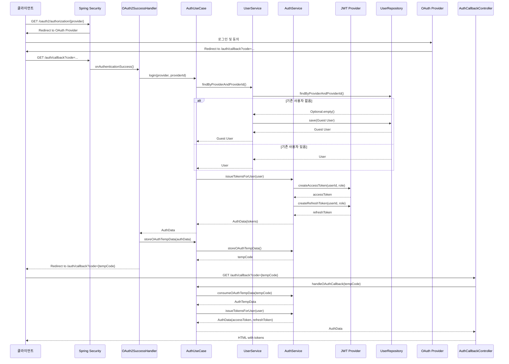
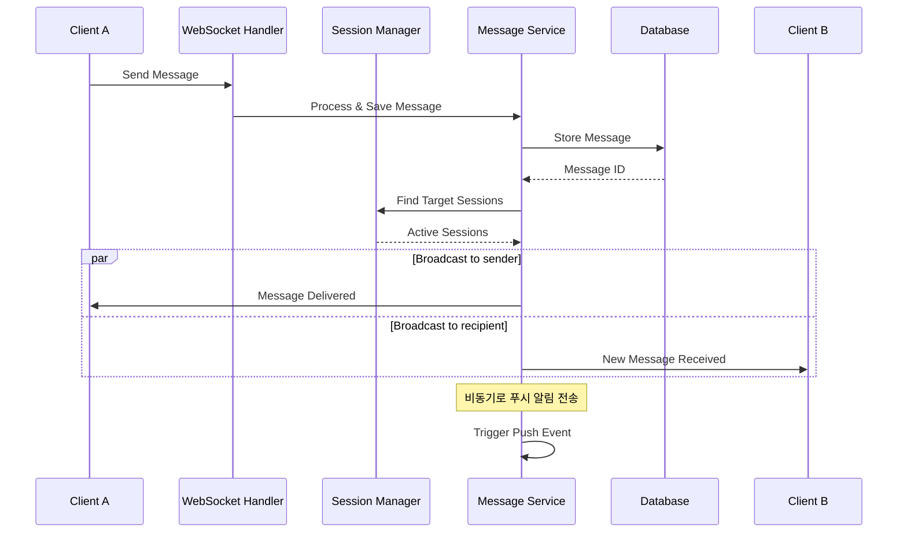
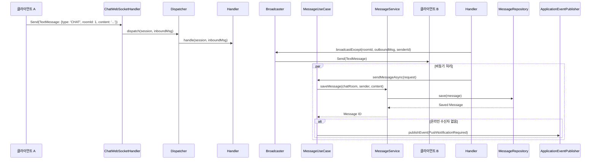
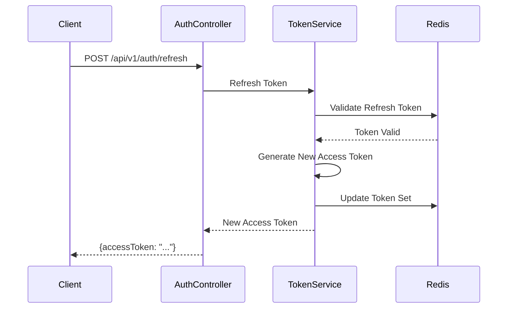

# 시퀀스 다이어그램

이 문서는 시스템의 주요 기능에 대한 시퀀스 다이어그램을 제공합니다.

## 1. 사용자 회원가입 및 로그인

OAuth2 소셜 로그인을 통해 사용자가 시스템에 처음 접근하여 회원가입하고, JWT를 발급받는 과정입니다.

## 2. 실시간 채팅 메시지 전송

WebSocket을 통해 클라이언트가 메시지를 보내고, 서버가 이를 처리하여 다른 클라이언트에게 브로드캐스트하는 과정입니다.

### 추상화 된 버전

### 클래스 간 상호작용 명확한 버전

## 3. JWT 토큰 갱신

