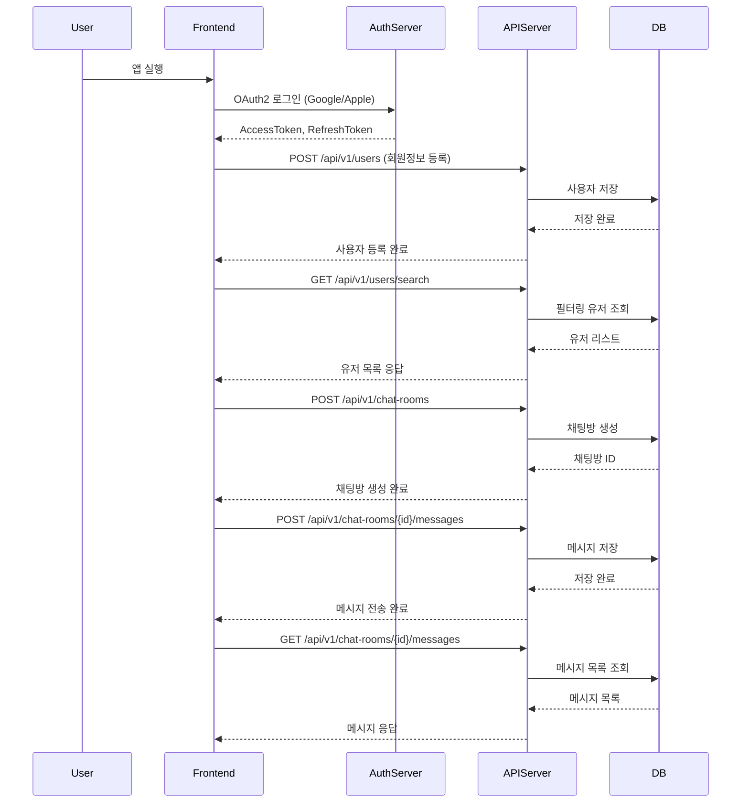

```mermaid
sequenceDiagram
    participant User
    participant Frontend
    participant AuthServer
    participant APIServer
    participant DB

    User->>Frontend: 앱 실행
    Frontend->>AuthServer: OAuth2 로그인 (Google/Apple)
    AuthServer-->>Frontend: AccessToken, RefreshToken

    Frontend->>APIServer: POST /api/v1/users (회원정보 등록)
    APIServer->>DB: 사용자 저장
    DB-->>APIServer: 저장 완료
    APIServer-->>Frontend: 사용자 등록 완료

    Frontend->>APIServer: GET /api/v1/users/search
    APIServer->>DB: 필터링 유저 조회
    DB-->>APIServer: 유저 리스트
    APIServer-->>Frontend: 유저 목록 응답

    Frontend->>APIServer: POST /api/v1/chat-rooms
    APIServer->>DB: 채팅방 생성
    DB-->>APIServer: 채팅방 ID
    APIServer-->>Frontend: 채팅방 생성 완료

    Frontend->>APIServer: POST /api/v1/chat-rooms/{id}/messages
    APIServer->>DB: 메시지 저장
    DB-->>APIServer: 저장 완료
    APIServer-->>Frontend: 메시지 전송 완료

    Frontend->>APIServer: GET /api/v1/chat-rooms/{id}/messages
    APIServer->>DB: 메시지 목록 조회
    DB-->>APIServer: 메시지 목록
    APIServer-->>Frontend: 메시지 응답

```