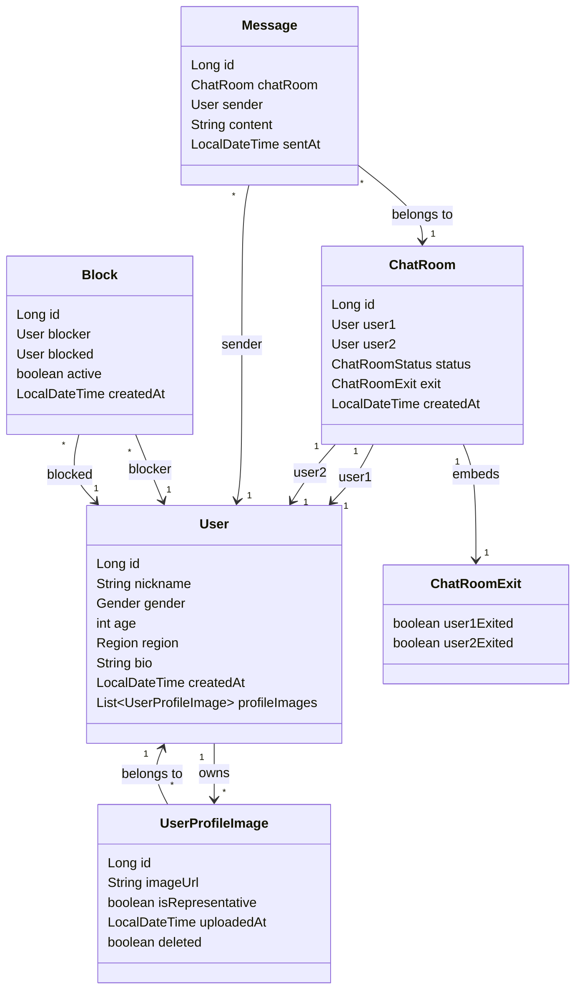

```mermaid
classDiagram
    class User {
        Long id
        String nickname
        Gender gender
        int age
        Region region
        String bio
        LocalDateTime createdAt
        List~UserProfileImage~ profileImages
    }

    class UserProfileImage {
        Long id
        String imageUrl
        boolean isRepresentative
        LocalDateTime uploadedAt
        boolean deleted
    }

    class ChatRoom {
        Long id
        User user1
        User user2
        ChatRoomStatus status
        ChatRoomExit exit
        LocalDateTime createdAt
    }

    class ChatRoomExit {
        boolean user1Exited
        boolean user2Exited
    }

    class Message {
        Long id
        ChatRoom chatRoom
        User sender
        String content
        LocalDateTime sentAt
    }

    class Block {
        Long id
        User blocker
        User blocked
        boolean active
        LocalDateTime createdAt
    }

    %% Relationships
    User "1" --> "*" UserProfileImage : owns
    UserProfileImage "*" --> "1" User : belongs to

    ChatRoom "1" --> "1" User : user1
    ChatRoom "1" --> "1" User : user2
    ChatRoom "1" --> "1" ChatRoomExit : embeds

    Message "*" --> "1" ChatRoom : belongs to
    Message "*" --> "1" User : sender

    Block "*" --> "1" User : blocker
    Block "*" --> "1" User : blocked

```