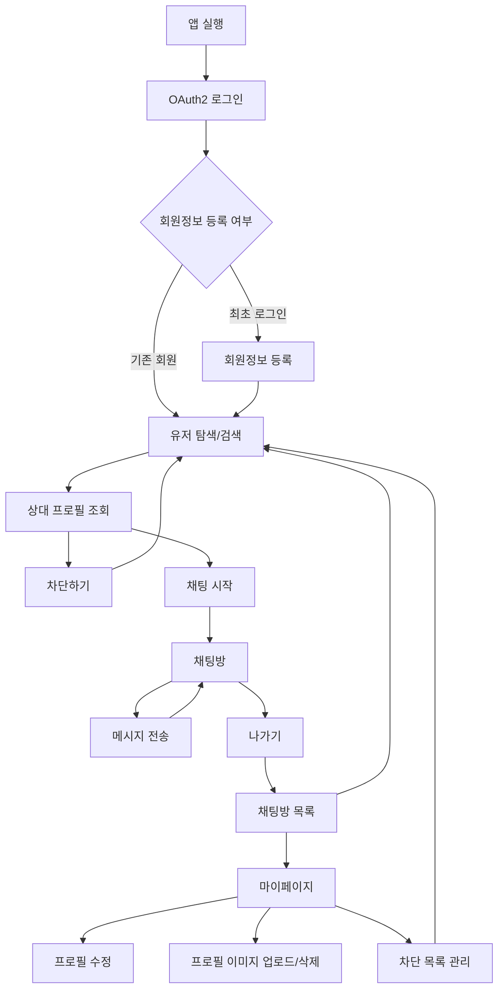

```mermaid
flowchart TD
    A[앱 실행] --> B[OAuth2 로그인]
    B --> C{회원정보 등록 여부}
    C -- 최초 로그인 --> D[회원정보 등록]
    C -- 기존 회원 --> E[유저 탐색/검색]
    D --> E

    E --> F[상대 프로필 조회]
    F --> G[차단하기]
    F --> H[채팅 시작]
    G --> E

    H --> I[채팅방]
    I --> J[메시지 전송]
    I --> K[나가기]

    K --> L[채팅방 목록]
    J --> I
    L --> E

    L --> M[마이페이지]
    M --> N[프로필 수정]
    M --> O[프로필 이미지 업로드/삭제]
    M --> P[차단 목록 관리]
    P --> E
```