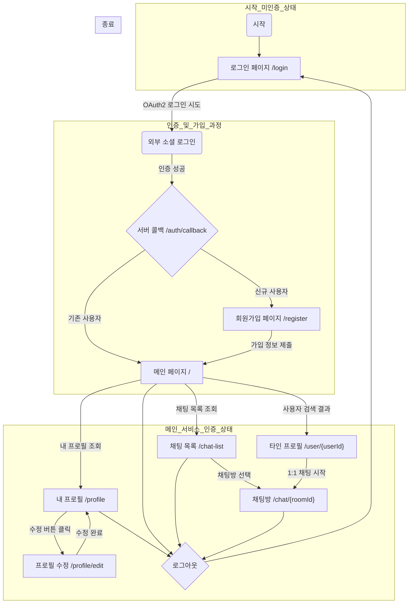

# 화면 흐름도

이 문서는 사용자의 주요 화면 전환 흐름을 다이어그램으로 나타냅니다. 서버가 제공하는 페이지 템플릿과 API 호출을 기반으로 사용자의 전체적인 서비스 이용 과정을 정의합니다.

## 전체 화면 흐름도

### 흐름 설명

1.  **시작 및 로그인**: 미인증 상태의 사용자는 로그인 페이지(`/login`)에서 시작하여 OAuth2 소셜 로그인을 시도합니다.
2.  **인증 콜백 및 분기**: 인증이 성공하면 서버는 사용자가 기존 회원인지 신규 회원인지 판별합니다.
    - **신규 사용자**: 추가 정보(닉네임, 프로필 등)를 입력하는 회원가입 페이지(`/register`)로 이동합니다. 가입을 완료하면 메인 페이지로 이동합니다.
    - **기존 사용자**: 즉시 로그인이 완료되어 메인 페이지(`/`)로 이동합니다.
3.  **메인 서비스 이용**: 로그인된 사용자는 메인 페이지를 중심으로 여러 기능에 접근할 수 있습니다.
    - **프로필 관리**: 자신의 프로필을 조회하거나 수정 페이지로 이동하여 정보를 업데이트할 수 있습니다.
    - **사용자 검색 및 채팅**: 메인 페이지에서 다른 사용자를 검색하여 프로필을 조회하고, `1:1 채팅 시작`을 통해 채팅방(`/chat/{roomId}`)으로 진입할 수 있습니다.
    - **채팅 목록**: 기존에 대화를 나눈 채팅방 목록을 확인하고, 특정 채팅방을 선택하여 대화를 이어갈 수 있습니다.
4.  **로그아웃**: 어느 페이지에서든 로그아웃을 선택하면 세션이 종료되고, 다시 로그인 페이지로 돌아갑니다.
